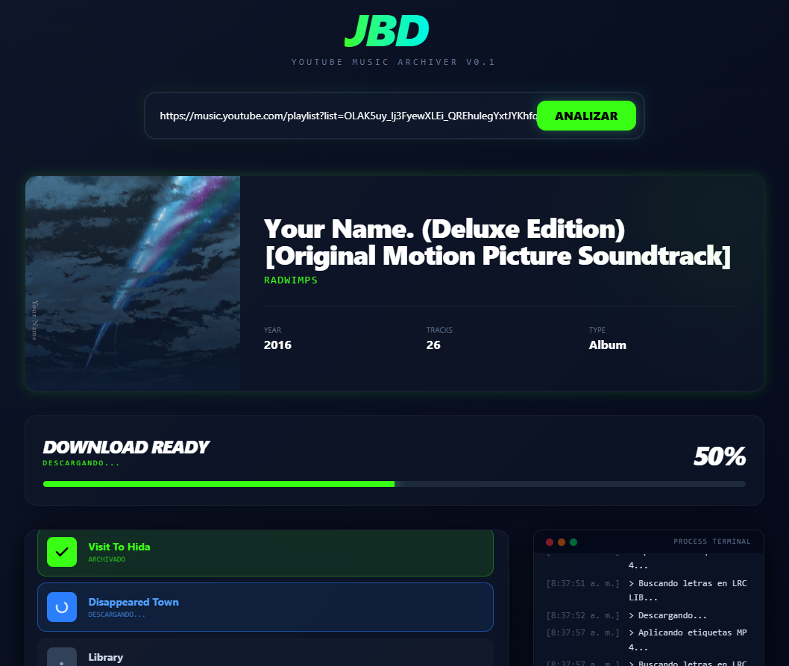

# JBD

¿Qué es JBD? Es una pequeña app para descargar música desde YoutubeMusic, centrada en el orden y la estructura de "discografías", digamos que tiene una filosofía de "album-first". Está construida sobre yt-dlp, ffmpeg y fastapi como elementos principales, y le he agregado una interfaz escrita en vue (lo mejor que he podido, soy patético en frontend, así que aún hay mucho que pulir allí).

Para ejecutarla probablemente necesiten tener instalado Ffmpeg previamente, y es posible que en algún momento determinado, requitan agregar un archivo de cookies de youtube si las descargas no funcionan (habrá que checar los logs del sistema).



## ¿De dónde salió esto?

Saludos a todos!... este si es un README escrito por un humano (y ezpero ke ezto lo demuestre). Bien. Este proyecto nació por una serie de accidentes y varios problemas que tuve previamente. Desde que conocí Jellyfin, mi lado "acumulador" se potenció en su aspecto digital, y el deseo de tener todo en mi propia PC, algo que nos define a los entusiastas del self-hosted.

Previamente había ya construido un servicio basado en el mismo concepto: #SpotifySaver, lamentablemente, no tengo como pagar spotify premium en este momento, y desde marzo de 2026 es un requisito indispensable tener cuenta premium para poder generar y usar una API Key desde la interfaz de spofity para desarrolladores.

Eso me llevó a tener que pasarme a otro servicio gratuito distinto: YoutubeMusic. Ya #SpotifySaver usaba YoutubeMusic, la lógica en aquel servicio era un algoritmo de búsqueda semántica y por duración de los tracks que coincidieran con la metadata que tenia en spotify y que obtenía de su API, y luego los bajaba, muchos otros servicios hacían lo mismo. Yo solo me salté ese paso y decidí operar directo sobre YoutubeMusic, aunque esto tiene otros problemas diferentes: no logro forzar que el navegador me entregue tracks de solo audio, y sigue intercalando vídeos y audio por igual.

¿Por qué esto es un problema? Porque ademas de la música (y las portadas de los discos), también descargo las letras sincronizadas (para ser usadas en servicios como Jellyfin o Navidrome, que es el que uso actualmente), y en ese caso la letra puede no ser encontrada o estar totalmente defasada porque el vídeo incluye metrajes adicionales que el track de solo audio no tiene (por ejemplo, Metallica hace técnicamente películas completas en sus vídeos musicales, y yo solo quiero el audio!).

Todos estos problemas procurare resolverlos con el paso del tiempo, pero las contribuciones son bienvenidas!

## 🚀 Instalación y Despliegue
De momento, no he construido aún una versión dockerizada, pero el sistema usa archivos .env para configurar las variables de entorno, entre ellas la ruta de almacenamiento de la música, por lo que podría suministrarse desde un docker compose o desde un .env y hacer que coincida con la ruta donde guardamos música para Jellyfin, Navidrome o Swingmusic (son los que he usado)-

### 1. Clonar el repositorio
```shell
git clone https://github.com/gabrielbaute/jbd.git
cd jbd
```

### 2. Preparar el Backend
Este proyecto utiliza `uv` para la gestión de dependencias, si no lo tienes, tocará instalarlo, en todo caso, inicializas con `uv` así:
```shell
uv sync
```

### 3. Preparar el Frontend
Instala las dependencias y genera el build de producción:
```shell
cd frontend
npm install
npm run build
```

### 4. Ejecución
Regresa al directorio raíz y arranca el servicio:
```shell
cd ..
uv run main.py
```

## ⚙️ Configuración Avanzada

JBD incluye un panel de configuración integrado en la interfaz que permite gestionar dinámicamente el archivo `.env` y los activos del sistema:

*   **Variables de Entorno:** Ajusta el Host, Puerto y niveles de Log. Sin embargo, estos cambios requerirán siempre un reinicio del servidor.
*   **Gestión de Cookies:** Para descargar contenido con restricción de edad o privado, puedes inyectar directamente el contenido de tu archivo `cookies.txt` (formato Netscape) desde el modal de ajustes.

El panel de configuración está teniendo problemas para funcionar la verdad, no he logrado enviar las modificaciones de forma correcta, supongo que tengo algo mal "cableado" entre el fronten y la API. Es otro de los puntos en donde agradecería ayuda.

## 📜 Filosofía

Este proyecto es estrictamente **Open Source**. Creo firmemente que el conocimiento y las herramientas de software deben ser libres y accesibles para cualquiera que tenga la capacidad de utilizarlas. Creo firmemente en la autonomía y el anarquismo, en la colaboración y el software libre.

Sobre la música descargada, entiendo que esta es una opción que puede entrar en conflicto con ciertos marcos legales, marcos pensados desde un inicio no para defender a los creadores de contenido sino a las corporaciones que lucran mercantilizando la música, la creatividad y la expresión artística de la humanidad. En ese sentido, considero que el apoyo directo a los artistas, sin mediación de corporaciones (por mas que muchas veces entiendan que su éxito depende de ser conocidos a través de estas plataformas) es siempre la opción más ética.

En la medida en que el capitalismo en su modo actual impide la existencia de un consumo ético dentro de una sociedad de mercado depredadora que nos cosifica, espero poder colaborar mediante iniciativas que nos ayudan a no depender de este tipo de plataformas.